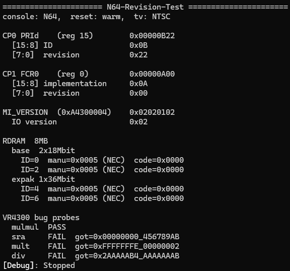

[](https://github.com/meauxdal/N64-Revision-Test/actions/workflows/build.yml)

## N64-Revision-Test 

this tool aims to aid in N64 hardware revision identification. bonus iQue Player compatibility. 

information is printed to the screen directly (and to the debug output, which includes some additional RDRAM details when run on N64 hardware). all tests give expected results per hardware revision thus far. tested on NTSC, MPAL, iQue. awaiting PAL testing. 

corresponding console mainboard currently specific to NTSC case pending more testing of regional variants. 

in terms of NTSC:  

| period | identification                    | range                           |
|--------|-----------------------------------|---------------------------------|
| early  | mulmul FAIL                       | NUS-CPU-01 through NUS-CPU-03   |
| mid    | mulmul PASS + base 2x18Mbit RDRAM | NUS-CPU-03 through NUS-CPU-05-1 |
| late   | base 1x36Mbit RDRAM               | NUS-CPU-06 through NUS-CPU-09-1 |

early NUS-CPU-03 units FAIL mulmul; all later units (including later NUS-CPU-03 units) PASS.

-----

also:
- reports PAL/NTSC/MPAL tvtype
- detects cold/warm boot
- detects 2x18Mbit (≤ NUS-CPU-05-1) vs 1x36Mbit RDRAM (≥ NUS-CPU-06) configurations via DeviceID + manufacturer + mfr. code
- detects Expansion Pak (expak 1x36Mbit RDRAM) + manufacturer + mfr. code
- debugf additionally dumps all potentially identifying RDRAM registers (this is a bit overkill for now but helps corroborate interpreted results)
- (iQue Player-only) detects NAND ID (manufacturer + part no. + size) 

---

**identifier registers**

| register   | field  | label          | known values    | notes             |
|------------|--------|----------------|-----------------|-------------------|
| CP0 PRId   | [15:8] | processor ID   | `0x0B`          | VR4300            |
| CP0 PRId   | [7:0]  | revision       | varies          | see below         |
| CP1 FCR0   | [15:8] | implementation | `0x0A` / `0x0B` | N64 / iQue        |
| CP1 FCR0   | [7:0]  | revision       | `0x00`          | all known units   |
| MI_VERSION | [7:0]  | IO version     | `0x02` / `0x03` | N64 / Analogue 3D |

**observed PRId revisions**

| rev    | unit              | mulmul expected result          |
|--------|-------------------|---------------------------------|
| `0x10` | 1.0               | FAIL  got=`0x05770421_05770422` |
| `0x22` | 2.2               | PASS                            |
| `0x40` | 4.0 (iQue Player) | PASS                            |

**base RDRAM configuration**

| base config | NTSC hardware range             |
|-------------|---------------------------------|
| 2x18Mbit    | NUS-CPU-01 through NUS-CPU-05-1 |
| 1x36Mbit    | NUS-CPU-06 through NUS-CPU-09-1 |

---

**bug probes**

| probe | what it tests | link |
|-------|---------------|------|
| `mulmul` | FP double-multiply hazard (sNaN/Zero/Inf operands) | https://n64brew.dev/wiki/VR4300#Multiplication_Bug |
| `sra` | 32-bit arithmetic right shift 64-bit state leak | https://n64brew.dev/wiki/VR4300#32-bit_Shift_Right_Arithmetic_Bug |
| `mult` | 32-bit signed multiply sign-extension anomaly | https://n64brew.dev/wiki/VR4300#Sign_extension_bugs |
| `div` | 32-bit signed divide sign-extension anomaly | https://n64brew.dev/wiki/VR4300#Sign_extension_bugs |

the `mulmul` probe uses a specific input pattern (`7F800000 * 37BAD25F, 38978B5D * 0C50A394`) confirmed to trigger the bug on affected hardware per logs provided by Buu42. original ctest.z64 test by HailtoDodongo; test here fixed by Jhynjhiruu.

mulmul probe confirmed to FAIL on at least 3 units known to be affected - all later units PASS. 

NUS-CPU-03 (mulmul PASS) example output:  


---

**observed output**

ID=4 and ID=6 are only printed if expansion pak RAM is detected (has_expak). 

**rev 0x10 (mulmul bug present)**
- PRId `0x00000B10`, FCR0 `0x00000A00`
- MI_VERSION `0x02020102` (IO `0x02`)
- mulmul - FAIL  got=`0x05770421_05770422`
- sra    - FAIL  got=`0x00000000_456789AB`
- mult   - FAIL  got=`0xFFFFFFFE_00000002`
- div    - FAIL  got=`0x2AAAAAB4_AAAAAAAB`

**rev 0x22 (mulmul bug fixed)**
- PRId `0x00000B22`, FCR0 `0x00000A00`
- MI_VERSION `0x02020102` (IO `0x02`)
- mulmul - PASS
- sra    - FAIL  got=`0x00000000_456789AB`
- mult   - FAIL  got=`0xFFFFFFFE_00000002`
- div    - FAIL  got=`0x2AAAAAB4_AAAAAAAB`

**iQue Player**
- PRId `0x00000B40`, FCR0 `0x00000B00`
- MI_VERSION: `0x0202B0B0` (IO `0xB0`)
- mulmul - PASS
- sra    - FAIL  got=`0x00000000_456789AB`
- mult   - FAIL  got=`0xFFFFFFFE_00000002`
- div    - FAIL  got=`0x2AAAAAB4_AAAAAAAB`

**ares v147-122-g0394fd90a**
- PRId `0x00000B22`, FCR0 `0x00000A00`
- MI_VERSION `0x02020102` (IO `0x02`)
- mulmul - PASS
- sra    - FAIL  got=`0x00000000_456789AB`
- mult   - FAIL  got=`0xFFFFFFFE_00000002`
- div    - FAIL  got=`0x0000000A_00000000` (different than hardware)

**MiSTer (N64 core) (20260524 "MTM3" build)**
- PRId `0x00000B22`, FCR0 `0x00000A00`
- MI_VERSION `0x02020102` (IO `0x02`)
- mulmul - PASS
- sra    - FAIL  got=`0x00000000_456789AB`
- mult   - PASS
- div    - FAIL  got=`0x0000000A_00000000` (different than hardware)

**Analogue 3D**
- PRId `0x????????`, FCR0 `0x????????`
- MI_VERSION: `0x??????03` (IO `0x03`)
- mulmul - ?
- sra    - ?
- mult   - ?
- div    - ?

---

uses libdragon preview branch, pinned to `c60bfbfc2c44b86e3627b06640b0260b89788118`

```
make
```

github actions builds automatically on push.

---

**from the libultra SDK documentation "Nintendo 64 Developer News 1.2"**

> Back-to-Back Floating Point Multiplies May Give Incorrect Results
>
> The following back-to-back multiply code sequence has the potential of producing an incorrect result in the second multiply:
>
>     mul.[s,d] fd,fs,ft
>     mul.[s,d] fd,fs,ft  or  [D]MULT[U] rs,rt
>
> The error happens only when the first multiply is a single- or double-precision floating-point operation and when one or both of its source operands are: Signalling Not-a-Number (sNaN), 0 (Zero), or Infinity (Inf).
>
> A single intervening instruction (e.g. NOP) prevents the problem.
>
> Affected versions: 1.x, 2.0, 2.1

---

**references**

- [Nintendo 64 Developer News 1.2](https://web.archive.org/web/20180810105528/https://level42.ca/projects/ultra64/Documentation/man/developerNews/news-02.html)
- [n64brew wiki - VR4300](https://n64brew.dev/wiki/VR4300)
- [u64check man page](https://help.graphica.com.au/irix-6.5.30/man/1/u64check)
